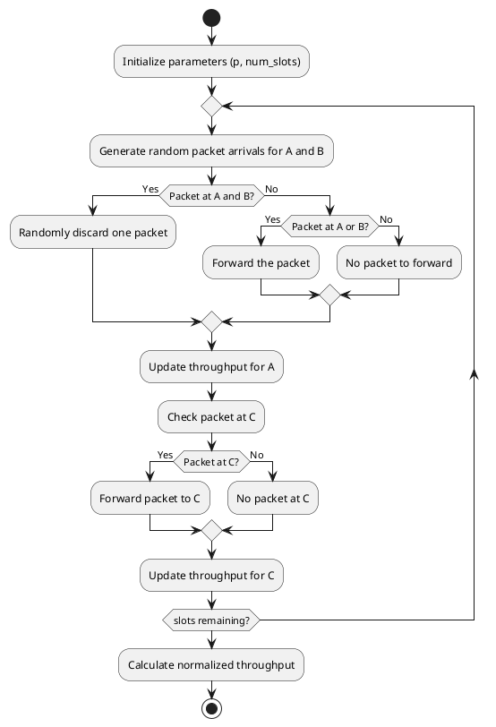

# Portfolio 1

## Flowchart

```plantuml
@startuml
start
:Initialize parameters (p, num_slots);
repeat
:Generate random packet arrivals for A and B;
if (Packet at A and B?) then (Yes)
  :Randomly discard one packet;
else (No)
  if (Packet at A or B?) then (Yes)
    :Forward the packet;
  else (No)
    :No packet to forward;
  endif
endif
:Update throughput for A;
:Check packet at C;
if (Packet at C?) then (Yes)
  :Forward packet to C;
else (No)
  :No packet at C;
endif
:Update throughput for C;
repeat while (slots remaining?)
:Calculate normalized throughput;
stop
@enduml
```